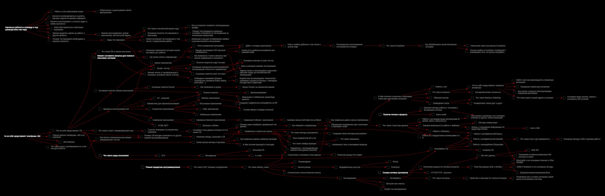

# Knowledge.DotNet
Набор атомарных единиц знаний, связанных между собой для изучения платформы .Net и языка C# в виде интерактивного дерева развития

## Концептуальное описание0
Делюсь своей экспертизой, выстроив из неё дорожную карту, которая поможет пройти по пути обучения в правильном порядке, когда новые знания базируются на пройденном материале.
## Как использовать
1. Скачайте [архив с файлами этого репозитория](https://github.com/Knowledge-Instruments/Knowledge.DotNet/archive/refs/heads/master.zip)
2. Распакуйте архив в любое место на компьютере
3. Загрузите и запустите [Unlimotion](https://github.com/Kibnet/Unlimotion)
4. В программе Unlimotion, в разделе Settings укажите путь до хранилища задач(TaskStorage Path) написав там полный адрес до каталога Tasks из архива
5. Перезапустите Unlimotion
6. Откройте раздел Unlocked
7. Начинайте изучать DotNet и С# беря любую разблокированную задачу
8. В процессе изучения отмечайте задачи выполненными и вам станут доступные новые, которые они разблокируют